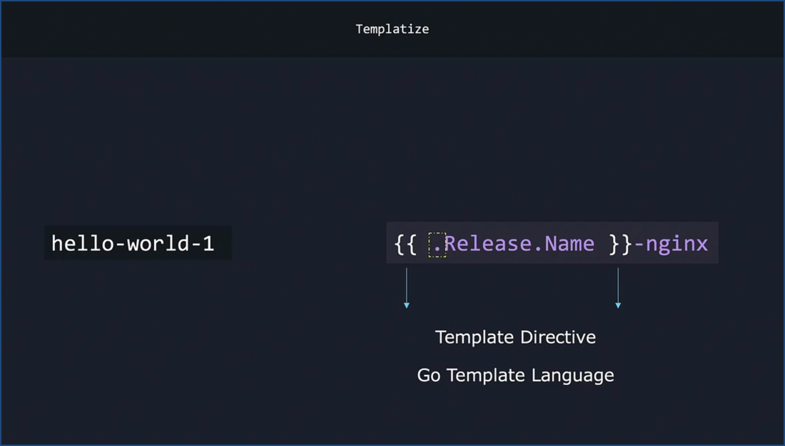
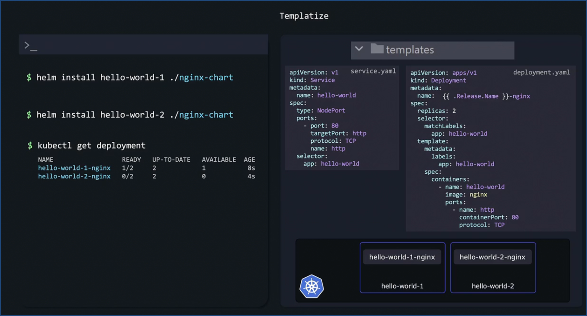

# 📦 Start Writing a Helm Chart

You can create a new Helm chart using:

```bash
helm create <chart_name>
```

Example:

```bash
helm create nginx-chart
```


## 🎯 Why Templating?

Hardcoding static values reduces reusability. Helm solves this with **templating**, allowing us to parameterize values and make charts flexible.


Helm uses **Go Templating** (from the Go programming language).

Example:

```go
{{ .Release.Name }}
```

Here, the `.` (dot) refers to the **root scope**.


## 🛠️ Templating in Action

Example with `Release.Name`:

```go
{{ .Release.Name }}-nginx
```

If the release name is `hello-world-1`, Helm will render:

```yaml
hello-world-1-nginx
```




## 📑 Common Template Directives

### Release Details

* `Release.Name`
* `Release.Namespace`
* `Release.IsUpgrade`
* `Release.IsInstall`
* `Release.Revision`
* `Release.Service`

### Chart Details

* `Chart.Name`
* `Chart.ApiVersion`
* `Chart.Version`
* `Chart.Keywords`
* `Chart.Home`

### Cluster Capabilities

* `Capabilities.KubeVersion`
* `Capabilities.ApiVersions`
* `Capabilities.HelmVersion`
* `Capabilities.GitCommit`
* `Capabilities.GitTreeState`
* `Capabilities.GoVersion`

### Values from `values.yaml`

* `Values.replicaCount`
* `Values.image`

> **Note:**
>
> * Built-in objects (`Release`, `Chart`, `Capabilities`) always use **UpperCase**.
> * User-defined values (`Values`) are typically **lowercase**.




## 📌 Best Practices for Values

* Use **`values.yaml`** for unique, environment-specific configurations.
* Keep **common defaults** inside the chart.
* Avoid creating duplicate object names.
* Always template values like **images**, **replicas**, and **names** instead of hardcoding.


## 📝 Referencing Values

There are two common patterns:


### 1️⃣ Flat Structure (Underscore style)

`values.yaml`

```yaml
# Default values for nginx-chart
replicaCount: 2

image_repository: nginx
image_pullPolicy: IfNotPresent
image_tag: "1.16.0"
```

`templates/deployment.yaml`

```yaml
apiVersion: apps/v1
kind: Deployment
metadata:
  name: {{ .Release.Name }}-nginx
spec:
  replicas: {{ .Values.replicaCount }}
  selector:
    matchLabels:
      app: hello-world
  template:
    metadata:
      labels:
        app: hello-world
    spec:
      containers:
        - name: hello-world
          image: {{ .Values.image_repository }}:{{ .Values.image_tag }}
          imagePullPolicy: {{ .Values.image_pullPolicy }}
```


### 2️⃣ Dictionary Style (Recommended)

`values.yaml`

```yaml
replicaCount: 2

image:
  repository: nginx
  pullPolicy: IfNotPresent
  tag: "1.16.0"
```

`templates/deployment.yaml`

```yaml
apiVersion: apps/v1
kind: Deployment
metadata:
  name: {{ .Release.Name }}-nginx
spec:
  replicas: {{ .Values.replicaCount }}
  selector:
    matchLabels:
      app: hello-world
  template:
    metadata:
      labels:
        app: hello-world
    spec:
      containers:
        - name: hello-world
          image: {{ .Values.image.repository }}:{{ .Values.image.tag }}
          imagePullPolicy: {{ .Values.image.pullPolicy }}
```


## ⚙️ How Helm Renders Templates

When you run:

```bash
helm install <release_name> ./nginx-chart
```

Helm combines:

* Templates from `/templates/`
* Values from `values.yaml`
* Release information (`Release.Name`, `Namespace`, etc.)
* Chart details from `Chart.yaml`

It then generates the final Kubernetes manifests.


---

✅ This ensures your charts are **reusable, flexible, and production-ready**.


